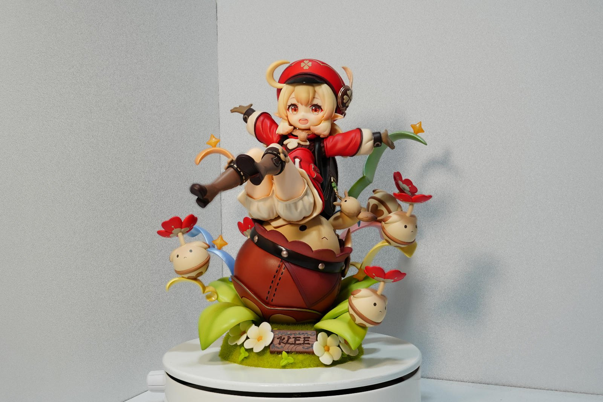
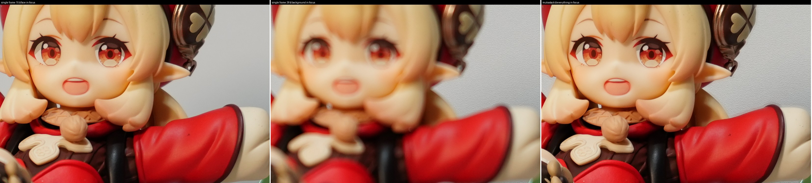
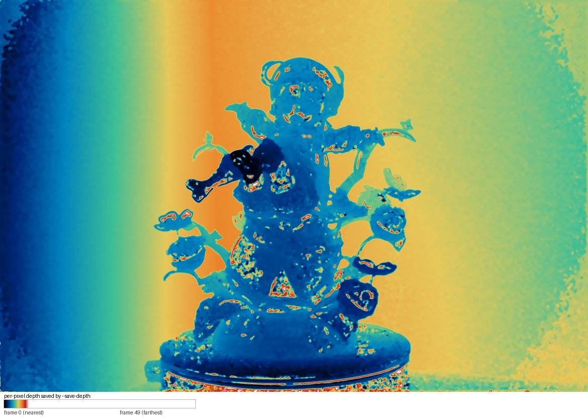

# Muka-Focus-Stacking

> 命令名 `mukastack`，crate 名 `muka-focus-stacking`，仓库名 `Muka-Focus-Stacking`。

把一组**包围对焦**（focus bracketing）照片合成一张全清晰的图片。纯 Rust，不依赖 OpenCV、
不需要 GPU 运行时，`cargo build --release` 出一个 exe。

为「手办/微距、三脚架、50 张左右、30MP+」这类素材写的：全程全分辨率深度分析，
目标不是"能合上"，而是**比商业软件修过的成品更锐、且不留合成痕迹**。

在本项目使用的参照素材上（索尼 33MP，50 帧，另有 Affinity Photo 人工修过的成品 `AF导出.png`
作为对照），六个区域的轮廓锐度**全部高于参照成品**：

| 区域 | 背景墙 | 膝盖边缘 | 光滑身体 | 底座叶片 | 面部 | 平坦背景 |
|---|---|---|---|---|---|---|
| 本工具 / AF 成品 | 1.22 | 1.19 | 1.19 | 1.17 | 1.12 | 1.14 |

代价与取舍、以及每个决定背后的测量，见下面的「工作原理」和 [开发记录.md](开发记录.md)。



<sub>成品缩略图（1600px）。原图 7008×4672，输出 16 bit PNG。这张照片是我自己拍的，
拍摄对象的版权说明见 [照片与版权](#照片与版权)。</sub>

---

## 构建

```bash
cargo build --release          # 产物 target/release/mukastack.exe
cargo install --path .         # 或直接装到 PATH，命令名 mukastack
```

无外部依赖（不需要 OpenCV / OpenCL / CUDA）。多核并行（rayon）。
内存峰值 ≈ `帧数 × 单帧像素数 × 3 字节`：50 帧 33MP 约 3.3 GB 缓存、峰值 5–6 GB。
显存不用。`--analysis-scale 2|4` 可以按平方倍降低内存与耗时。

## 快速开始

```bash
# 1) 直接给一个目录（自动按文件名排序、自动剔除尺寸不一致的成品牌图）
mukastack "D:/photos/stack" -o merged.png

# 2) 想要预览（顺便出 1600px 的 JPEG 便于快速看）
mukastack "D:/photos/stack" -o merged.png --preview preview.jpg

# 3) 素材很大又赶时间：深度分析降到 1/2 分辨率（候选窗口会按尺度自动换算）
mukastack "D:/photos/stack" -o merged.png --analysis-scale 2
```

**什么都不用调就是最高质量。** 默认值＝全分辨率深度分析 + `bracket` 融合 + 边缘感知的深度聚合
＋两侧夹取，是逐项量出来的最优点，不是拍的。

输出 `.png` 是 **16 bit**（8 bit 会在渐变处产生可见的带纹）；给 `.jpg` 则写质量 95 的 8 bit。

## 效果示例

同一台相机、同一个三脚架、同一组照片。左边两张是**原始帧**，右边是**本工具的输出**——
1:1 裁切，未做任何锐化或修图：



<sub>裁切位置：输出画布 x3200–4300、y1050–1800（可莉的面部与右侧背景墙）。
帧 15 是面部最清晰的那一帧（此时背景墙完全虚掉），帧 28 是背景墙最清晰的那一帧
（此时面部已经软了 56%）。合成结果把两者都取上。</sub>

这是 `--save-depth` 导出的逐像素深度场（也就是「每个像素取自哪一帧」），可以直接用来检查
深度有没有串（比如轮廓外有没有被误判成前景）：



<sub>颜色 = 帧号，蓝＝近、红＝远。房间左角的墙最近、右墙最远，手办本体是最近的一层。
把这张图和输出叠起来看，是排查「某块区域发虚/发亮」最快的办法。</sub>

上面的图都是这套参数直接跑出来的（命令见 [快速开始](#快速开始)），没有人工修饰。

## 用法

```bash
# 基本：给目录，或直接给一串文件（可以混）
mukastack 帧目录 -o merged.png
mukastack a.jpg b.jpg c.jpg -o merged.png

# 最平滑（不逐频段仲裁）：几乎没有合成痕迹，但明显更软
mukastack 帧目录 -o soft.png --mode pyramid

# 最锐（逐频段全栈取最大）：锐但会带光晕与噪声，一般不用
mukastack 帧目录 -o hard.png --mode max

# 只要原图不裁切 / 手动指定裁切区 x,y,w,h
mukastack 帧目录 -o merged.png --no-crop
mukastack 帧目录 -o merged.png --crop 1400,300,4275,4002

# 诊断：导出深度场 / 夹取用的帧范围 / 预览图
mukastack 帧目录 -o merged.png --save-depth d.png --save-conf c.png --save-range r
mukastack 帧目录 -o merged.png --debug-point 2700,1800        # 该画布坐标的逐帧响应
```

### 三种融合模式怎么选

| 模式 | 一句话 | 什么时候用 |
|---|---|---|
| `bracket`（默认） | 颜色与亮度跟随深度值，细节频段在深度附近 ±K 帧内由能量决定取哪一帧 | 默认就是它，不用改 |
| `pyramid` | 全部频段都只按深度值插值 | 素材噪声大、或你想看"完全不仲裁"的基线 |
| `max` | 每个频段在**整个栈**里取最强的那一帧 | 只想看细节上限；会带光晕和噪声 |

`pixel`（像素域交叉淡化）与 `hard`（逐像素只取一帧）保留用于对照实验。

### 参数速查

说明里括号中的 ①–⑪ 是 bug 编号，完整记录见 [开发记录.md](开发记录.md)。
下面按"你会想动的顺序"排。★ = 常规调参只需要看这几个。

#### 输入输出

| 参数 | 默认 | 说明 |
|---|---|---|
| `<INPUTS>...` | — | 文件、目录，或混合。目录会被扫描 |
| `-o, --output` | `merged.png` | 输出路径，扩展名决定格式 |
| `--preview` / `--preview-size` | 关 / `1600` | 额外写一张小尺寸 JPEG |
| `--threads` | `0`＝自动 | 线程数 |
| `--quiet` | 关 | 不打印进度 |
| `--all-sizes` | 关 | 不按多数派尺寸过滤（默认会剔除尺寸不同的成品图） |
| `--no-match-exposure` | 关 | 跳过逐帧亮度匹配（默认会先对齐曝光） |

#### 融合 ★

| 参数 | 默认 | 说明 |
|---|---|---|
| `-m, --mode` ★ | `bracket` | 见上表 |
| `--bracket-radius` ★ | `16` | 细节频段的候选窗口半径（帧）。0＝只用夹住深度的两帧 |
| `--coarse-levels` | `4` | 最粗的 4 层改用窄窗口。**治轮廓外的宽亮带**（⑩ / ⑪） |
| `--bracket-radius-coarse` | `0` | 上述窄层的半径 |
| `--bracket-strength` | `1.0` | 仲裁权重；0 等价 `--mode pyramid` |
| `--base-winner` | `0` | 低频道（颜色/亮度）是否也参与取优。**保持 0**：颜色亮度跟随深度才不会出光晕 |
| `-l, --levels` | `0`＝自动 | 金字塔层数（自动取可用层数的 2/3） |
| `--band-power` | `0` | 0＝取最大；2–8＝能量加权平均（更干净但更软） |
| `--band-energy-smooth` | `2` | 选赢家前把该频段能量在半径内聚合，让判决空间连贯（⑧） |
| `--band-energy-gate` | `0.7` | 只在判决不确定处用"邻域连贯"的赢家 |
| `--denoise` | `0` | 频段软阈值（×噪声 sigma）。**默认关**：能压噪声的阈值同时会抹掉光滑面的真实微纹理 |
| `--no-clamp-range` / `--no-clamp-lo` / `--no-clamp-hi` | 夹取全开 | **不要关**：两侧夹回"帧实际取值范围"是"输出不含输入没有的值"的硬保证（⑥ / ⑨） |
| `--clamp-slack` / `--clamp-hi-dilate` | `0` / `0` | 夹取容差（级）与上界膨胀半径 |

#### 深度场（一般不用动）

| 参数 | 默认 | 说明 |
|---|---|---|
| `--focus` | `sml` | `sml` / `tenengrad` / `variance` |
| `--gray` | `luma` | `luma`＝固定 Rec.601 权重。**不要用 `pca`**：那是逐帧归一化，见 ④ bug 4 |
| `--analysis-scale` ★ | `1` | 深度分析的降采样倍数。**默认全分辨率**：降采样会先把随对焦变化的最细结构平均掉。只在大批量赶时间时用 2 |
| `--focus-radius` ★ | `4` | 焦点测度窗口半径（全分辨率像素）。**4 而不是 16**：窗口跨过强边缘时深度会落到远侧表面内部，见 ⑪ bug 11 |
| `--focus-prefilter` | `1` | 算测度前的小半径模糊，压像素级噪声底 |
| `--edge-aware` ★ | `16` | 焦点响应先按图像加权聚合再取 argmax，**窗口不再跨过主体边缘**——轮廓外亮带的根因修复（⑪）。0＝关 |
| `--edge-eps` | `0.0001` | 上述引导滤波的正则项 |
| `--coarse-scale` | `4` | 粗先验的降采样倍数（1＝关） |
| `--refine-window` | `8` | 逐像素搜索相对粗先验的半宽（帧） |
| `--depth-median` | `2` | 深度场去斑中值半径 |
| `--depth-bilateral` / `--depth-sigma` | `6` / `1.5` | 按**深度相似度**加权的平滑（不会把台阶摊开） |
| `--guided-radius` / `--guided-eps` | `6` / `0.001` | 引导滤波半径/正则项；把深度台阶吸附到图像边缘 |
| `--depth-smooth` | `2` | 引导滤波迭代次数 |
| `--conf-smooth` | `32` | 判定"有无焦点信息"时的聚合半径 |
| `--adaptive-window` / `--seam-window` | `0` / `0` | 候选窗口按深度不确定度张开 / 按深度变化收缩。实测对已知缺陷近中性 |
| `--prior-window-gain` / `--prior-window-radius` | `1` / `8` | 粗先验的稳健统计增益与半径 |
| `--depth-trust` | `0` | 深度可信度门控 |

#### 对齐与裁切

| 参数 | 默认 | 说明 |
|---|---|---|
| `--no-align` | 关 | 跳过几何对齐（三脚架极稳、且主体顶到画幅边缘时可以试） |
| `--align-work-size` | `900` | 对齐搜索的工作分辨率 |
| `--align-scale-range` / `--align-scale-steps` | `0.02` / `16` | 缩放搜索半宽与步数 |
| `--align-focus-blur` | `3` | **注册特征前的低通半径**。消除"匹配的是模糊程度而不是几何"，见 ① bug 1 |
| `--margin` | `2` | 自动裁切时额外内缩的像素 |
| `--no-crop` / `--crop x,y,w,h` | 关 / — | 关掉自动裁切 / 手动指定 |

#### 诊断

| 参数 | 说明 |
|---|---|
| `--save-depth <prefix>` | 导出深度场（16 bit，画布尺寸；并写 `_final` 版本） |
| `--save-conf <prefix>` | 导出置信度图（8 bit） |
| `--save-range <prefix>` | 导出夹取用的**已 warp** 逐像素 lo/hi。判断"输出里有没有输入没有的值"的唯一权威（⑨） |
| `--debug-point x,y` | 打印该**画布**坐标处每帧的焦点响应（重采样前/搬移后各一份） |
| `--depth-trace Y,X0,X1` | 打印某一行在深度后处理各阶段的剖面 |
| `--depth-fix x,y,w,h,frame` | 强制指定矩形（**输出图**坐标）用某个帧号，可重复。手工兜底，见 开发记录 |

---

## 工作原理

焦点堆叠分三层。下面提到的 ①–⑪ 各 bug 的完整记录（症状、判据、机制、被推翻的假设）在 **[开发记录.md](开发记录.md)**，这里只保留结论。


### ① 焦点测度 —— 每个像素"在哪一帧最清晰"

- **SML**（Sum of Modified Laplacian，Nayar & Nakagawa 1994）默认。对光照渐变不敏感、计算便宜、对散焦单调递减。
- `Tenengrad`（Sobel 梯度能量）、`Variance`（局部方差）可选，`--focus` 切换。

关键约束：测度必须**跨帧可比**，所以不做任何逐帧归一化。

另外两条同样关键的约束，都是被 bug 教出来的：

- **必须在未重采样的原帧上计算**。测度对重采样相位极其敏感（见 ⑤ bug 2），
  所以先在各帧自己的坐标里算出响应场，再把响应场搬到画布坐标；图像本身照旧 warp。
- **窗口大小以全分辨率像素为准**（`--focus-radius` 默认 16，内部再除以分析尺度），
  这样换分析尺度时窗口的物理大小不变。

### ② 深度场 —— 把"哪一帧最清晰"变成连续场

朴素做法是每像素硬取 argmax，结果是**马赛克色块**。本项目的处理：

1. 沿帧序做 argmax，并在**局部极大值处用抛物线插值出亚像素帧号**（12.4 这种）
2. **无信息像素从邻域填充**：原始响应峰值恒为 0 的像素（平坦 JPEG 块）不允许投票，
   否则它们会以"第 0 帧"这个虚构值污染整个邻域（见 ⑤ bug 3）
3. 中值滤波去孤立尖峰（不扩散边界）
4. **引导滤波**（Guided Filter，以全栈平均灰度为导向图）把深度场吸附到物体边缘

早期版本用的是"置信度百分位掩膜 + 多尺度 push-pull 补洞"，那条路已经放弃：
百分位**必然**让固定比例的像素被替换，不管它是否真的不可靠（见第 8 节第 6 条）。

### ③ 融合 —— 三种策略，`bracket` 为默认

- **`bracket`（默认）**：两路累积器。一路是**深度插值**（在深度值两侧的两帧间按小数权重混合），
  另一路是**逐频段在"深度值 ±K 帧"窗口内取系数能量最大者**。最后按 `--bracket-strength` 线性混合。
  这样既拿到逐频段的锐度，又不会让选择跑到深度场之外（那才是光晕的来源）。

  `K`（`--bracket-radius`）默认给到 **16**，比直觉上需要的大得多，这是有意的：
  深度场在低对比细节处仍是弱环——有些表面（光滑树脂、无浮雕的墙面）**根本没有焦点信息**
  （实测：整条栈上的响应曲线是平的，没有任何峰），那里的深度是填补值，
  而**这个窗口正是它的补救**：窗口够宽就能碰到真正清晰的那一帧，让该频段自己的能量把它选出来。
  之所以不产生光晕，是因为只有**细节频段**可以游走，颜色和亮度始终跟随深度值。
  实测 K 从 0 加到 16：墙面轮廓锐度 21.98 → 23.33、叶片 22.71 → 24.44、面部 55.36 → 58.23
  （参照成品分别是 19.13、20.90、52.10），而**最平坦区域的颗粒度没有变差**（见第 4 节）。
  以前"窗口越宽噪声越大"那个现象，是深度场算错造成的，不是窗口的固有代价。

  深度修好之后（见下方"灰度转换"一节），K 的效果在 4 以上就进入平台：
  K=4 / 8 / 16 的墙面分别是 23.18 / 23.35 / 23.33。
  K 仍保留 16，因为**无信息的表面确实依赖它**。

  顺带一提：正因为这个窗口在兜底，**焦点测度的精度对最终画质影响很小**。
  实测把 `--focus` 从 SML 换成 Tenengrad（后者在低对比区对真实锐度的排序相关性
  0.895 对 0.549、动态范围 3.1× 对 1.5×，明显更好），端到端输出**完全一样**
  （gradE 6.747 对 6.757，各区域轮廓锐度逐位相同）。要提升画质，应该去修深度场
  或者放宽窗口，而不是换测度。
- **`pyramid`**：只有深度插值那一路。最平滑，但**系统性丢细节**（实测只到理论上限的 60%）。
- **`max`**：全栈逐频段取最大系数。最锐，但选择无约束，光晕和噪点风险最高。
- **`pixel` / `hard`**：像素域过渡 / 硬选帧，用于快速预览和检查深度图。

### ④ 去噪 —— 一个追了很久的幻影

逐像素"取最大"是一个**极值统计量**：即使所有帧在该处都没有真实信号，N 帧里的最大值也系统性地高于任何单帧。
这是本项目从第一轮起的核心担心，也是 `--denoise` 存在的理由。

**但这个担心在本素材上没有被证实。** 早期的"验证"用的是整块背景的纹理 std 或高频能量，
那些量**同时包含真实细节**，所以看上去总是在支持"我们更噪"。
直接去测**全图最平坦的那块 200×200**（在参照成品上按梯度能量找出来）得到的是相反的结论：
颗粒度 1.332 对参照成品的 1.400——**最平坦的地方我们更干净**。
全图上多出来的高频是真实细节（见第 4 节）。

所以频段软阈值**默认关闭**（`--denoise 0`），而且实测它在任何档位下都是净损失：
`0.08 / 0.15` 让各区域锐度全线下降，而背景 std 只降了 0.6。
如果哪天真要压噪，`--band-power 2~8` 是更温和的一条路（见 ⑤ 的取舍曲线）——
它在那里平均噪声、在真实结构处几乎等于取最大帧。

结论：**要细节，不要阈值。** 只有当素材本身噪点确实很大时才考虑这两条路。

### 端到端流水线

```
[1/4] 解码 + 缓存      每帧解码一次 → **固定权重亮度**（Rec.601，逐帧相同）
                       → 缓存为 16bit；50 帧 33MP 约 3.3 GB（若存 f32 需 6.5 GB）
[2/4] 对齐             工作分辨率上**先低通**（消掉离焦差异，只留几何）
                       → 粗搜尺度 → 精搜 → 每个候选用 2D FFT 相位相关求残差平移
[3/4] 深度场           在**未 warp 的原帧**上算 SML（默认全分辨率）
                       → argmax + 抛物线亚像素细化
                       → 原始响应为 0 的像素从邻域填充 → 中值 → 引导滤波
                       响应场按变换搬到画布；图像本身仍 warp，供引导和融合使用
[4/4] 融合             再解码一次（一次一帧），拉普拉斯金字塔
                       逐频段深度插值 + 窗口内系数能量仲裁 → 塌缩 → 16bit PNG
```

**内存策略**：解码结果一次只驻留一帧，融合只保留累积器金字塔。
50 帧 33MP 的全分辨率灰度缓存约 3.3 GB，加融合缓冲峰值约 5–6 GB
（若把 50 帧 f32 RGB 全放内存需要 19 GB）。
把 `--analysis-scale` 设为 2 可把缓存降到约 0.8 GB，代价是深度精度下降。

---

## 这套素材的特性（决定了实现重点）

对一组 50 张的 33MP 手办微距素材先做侦察（下面的数字都出自这一组）：

- 7008×4672（33MP，索尼 A7R 系列），50 帧
- **平移 = 0**：三脚架拍摄，帧间位移在 ±4px 内
- **对焦呼吸缩放真实存在，但幅度比早期估计小**。用"先重模糊再搜缩放"的**对焦无关**
  方法测得 scale 从第 0 帧的 0.9955 平滑单调升到第 49 帧的 1.0045（全程约 0.9%，
  即两端相对中段各约 ±0.45%）。必须修正，但绝不足以解释任何大范围错位——
  早期估出的 1.0075 和 8 像素平移，都是估计器被对焦污染的产物（见 ⑤ bug 1）
- **曝光漂移**：全图均值 163.55 → 166.28（约 1.7%）
- 整体梯度能量在第 12 帧达峰后单调下降，**焦点扫掠的远端大幅超出景深**
- 同目录还有 `AF导出.png`、`堆叠.af`、`合并.psd`、`抠图.psd` 等成品/工程文件

所以：对齐模块不能省，但不必用 ECC；且**目录扫描必须按像素尺寸过滤**，
否则会把成品图当成一帧（本项目自动剔除少数派尺寸并打印提示）。

---

## 质量基线与取舍

新手容易拿"单张最锐的帧"当上限 —— 那是错的。焦点堆叠的正确上限是
**逐像素取全栈最大梯度**（每个像素都从它最清晰的那帧取，融合不可能比这更锐）。

在参照成品的裁切区域内（4275×4002）：

| 方案 | 梯度能量 | 占理论上限 | 最平坦区域颗粒度 |
|---|---|---|---|
| 理论上限（逐像素取全栈最大） | 7.77 | 100% | — |
| `max`（不做深度约束） | 6.97 | 89.7% | — |
| **`bracket` 默认（全分辨率 + 窗口 16）** | **6.90** | **88.8%** | **1.332** |
| **AF导出（Affinity 成品，含人工修图）** | **5.32** | **68.4%** | **1.400** |

（`pyramid` 纯深度插值 4.69 / 60.4%；单张最锐原帧 2.65 / 34.1%。）

`max` 的 gradE 略高，但它是**不做深度约束**换来的：在同一组区域里
背景墙 22.38 对默认的 23.33、颗粒度 4.228 对 4.125。
所以默认仍是 `bracket`。

两个结论：

1. **任何单帧都远不是上限**（34%），焦点堆叠的价值就在这里。
2. **"梯度能量高就是噪点"这个担心在本场景不成立**：在最平坦的 200×200 区域，
   我们的颗粒度是 1.332，反而**低于**参照成品的 1.400。全图上多出来的高频能量是真实细节。
   （早期版本用整块背景的纹理 std 当噪声判据，那个量同时包含细节，因此误导了好几轮。）

### 更贴合目视的指标：轮廓锐度

梯度能量/纹理 std 这一对不够 —— 它们把**细节和颗粒混在一个数里**。
判断"看起来锐不锐"要看**轮廓陡度**：最强 0.5% 边缘像素的梯度峰值。
判断"是否有噪声"则要看**最平坦区域**的颗粒度（见第 4 节上半），
两者分开之后结论就不再自相矛盾了。

（早期这里写着"实测 `max` 模式在叶片上细节能量最高、看起来却最糊"——
那是在三个 bug 之上测的。管线修好后 `max` 与默认在叶片上是 24.41 对 24.44，
没有差别；而 `max` 在没有深度约束的地方反而更差，见 ⑤。）

在参照成品裁切区内的 6 个典型区域，与 AF导出 的轮廓锐度之比（原点自动定位，见 ⑤）：

| 区域 | AF导出（绝对值） | mukastack | 比值 |
|---|---|---|---|
| 背景墙（浮雕） | 19.13 | 23.33 | **1.22** |
| 膝盖边缘 | 47.12 | 56.27 | **1.19** |
| 光滑身体 | 47.52 | 56.65 | **1.19** |
| 底座叶片（光滑树脂） | 20.90 | 24.44 | **1.17** |
| 面部（高对比，对照组） | 52.10 | 58.23 | **1.12** |
| 平坦背景 | 28.29 | 32.14 | **1.14** |

**六个区域全部高于参照成品**，而参照成品是带局部修图的（`合并.psd`/`抠图.psd` 也在同目录）。

---

## 代码结构

```
src/
  main.rs      CLI、流水线编排、目录扫描与尺寸过滤、输出
  util.rs      Plane / RgbImage 容器、盒滤波、高斯滤波、Catmull-Rom 插值、稳健统计
  pyramid.rs   5 抽头二项式核的高斯/拉普拉斯金字塔、塌缩
  focus.rs     SML / Tenengrad / 局部方差 焦点测度
  depth.rs     流式 argmax + 亚像素细化、无信息像素判定与补洞、深度域双边平滑、中值
  align.rs     低通后的梯度特征、2D FFT 相位相关、两级尺度搜索、三次插值重采样
  fuse.rs      裁切计算、双累积器金字塔融合、能量加权候选合并、频段软阈值去噪
tools/         Python 侦察/评估脚本（不参与构建，见下）
docs/          README 里用到的示例图（都是本工具在这套素材上的真实输出）
```

## 分析工具（tools/）

这些脚本**不参与 cargo 构建**，是我用来量化"这一版比上一版好还是差"的独立工具（Python + numpy + pillow）。
它们的价值在于**判据**：每个脚本都在注释里写清楚了它量的是什么、以及什么情况下它会骗人。

### 现用（跨版本对比看这几个就够）

| 脚本 | 作用 |
|---|---|
| `patchlib.py` | **逐区域对比的标准入口**。自动定位每个输出图的裁切原点，再给轮廓锐度/颗粒度。被下面多个脚本当库用 |
| `eval_all.py` | 批量评估多个输出图，输出分区域轮廓锐度与整体差异 |
| `truth.py` | **独立真值**：直接在解码原帧上算局部锐度，给出各位置的"真实最锐帧" |
| `depthcheck.py` | 在指定位置采样深度场，与真值逐点对照 |
| `bandlib.py` | 轮廓带测量的公共库（盒和、纹理、主体掩膜、局部对比） |
| `bandeval.py` | 轮廓带的纹理比 + gradE + 颗粒；`--frames` 可取原帧作参照 |
| `bandtruth.py` | 轮廓外亮度随距离的变化，参照＝逐像素取深度对应帧 |
| `depthtruth.py` | **深度真值**：把主体排除出测度窗口后重新取最锐帧，给出逐距离的深度误差与亮度偏差 |
| `sidetruth.py` | 上者的**两侧**版本（主体侧也各自排除对面），用来判断亮边在哪一侧 |
| `banddelta.py` | 相对"墙面合焦帧"的亮度增量（单帧基准） |
| `bandexcess.py` | 自参照的"超出远端拟合"量 |
| `sideprofile.py` | 轮廓两侧的纹理/亮度剖面 |
| `deptherrmap.py` / `rimmap.py` | 深度误差 / 亮度残差热力图（蓝＝偏近或偏暗，红＝偏远或偏亮） |
| `bandchart.py` / `bandchart_cells.py` | 距离-亮度曲线与"减去真值"的曲线 |
| `bandview.py` / `mkzoom.py` | 背景去除放大对比 / 通用高倍并排 |
| `overshoot.py` | 输出是否越出"帧实际取值范围"（要看 `--save-range` 导出的已 warp 范围） |
| `mkreview_band.py` / `mkreview.py` | 把一次改动的证据打成一个可浏览的检查包（`out/检查_*/index.html`） |

### 历史脚本

其余脚本是开发过程中针对具体疑点写的一次性探针（`bloom.py`、`softscan.py`、`edgeband.py`、
`distdecay.py`、`stepoffset.py`、`measure_probe.py`、`pixel_probe.py`、`argmax_probe.py`、
`seam.py`、`confcal.py`、`recon.py`、`breath.py`、`scale_test.py`、`colour_audit.py`、`diag.py`、
`depthview.py`、`selmap.py`、`softmap.py`、`localize.py`、`ideal.py`、`ceiling.py`、`compare.py`、
`strip.py`、`threeway.py`、`grid.py`、`probe_*.py`…）。
**它们的坐标约定可能过时**（尤其是硬编码裁切原点的那些），结论以 `开发记录.md` 里的记录为准。

### 诊断顺序（遇到"某处不对"时）

1. `eval_all.py` / `patchlib.py` → 找出与参照成品差异最大的区域，**确认坐标属于哪张图**
   （输出图 / 参照裁切图 / 原始画布三者互差一个偏移）
2. `mkzoom.py`、`bandview.py` → 放大目视，先看清楚"不对"是什么形态（过冲？发虚？色偏？）
3. 需要数字时，按现象选判据：
   - 越界/光晕 → `--save-range` + `overshoot.py`
   - 轮廓外的亮带 → `bandtruth.py` / `depthtruth.py`（**真值必须独立于被测对象**）
   - 光滑面颗粒 → `grain.py`
   - 区域锐度 → `patchlib.py`
4. 深度可疑 → `--save-depth` + `depthtruth.py` + `deptherrmap.py`
5. 还不清楚 → `--debug-point x,y` 看工具自己看到的逐帧响应

> 一条反复踩出来的规矩：**参照不能由被测对象自己生成**（拿工具自己的深度图去挑参考帧，
> 深度错在哪参照就错在哪，差值恒等于零），以及**比值判据必须先确认分母没被一起改动**。

## 已知限制与取舍

这些不是"以后再说"的待办，是**量过之后的取舍**，知情比修好更重要：

- **光滑表面上的噪声与真实微纹理不可分离。** 树脂、漆面、皮肤上，每像素响应的信噪比接近 1，
  任何能压住噪声的阈值都会同时抹掉真实纹理（视觉上就是"糊"）。所以 `--denoise` 默认关，
  噪声按原样保留——保留噪声比抹掉细节更接近真实。素材本身噪声大时才建议开。
- **紧贴轮廓 1–3 像素有一道很细的亮边。** 这是焦点堆叠在硬边缘上的过冲（拉普拉斯振铃），
  两侧夹取已经砍掉大部分。人工修过的参照成品在同一位置**更明显**（+10.2 对 +3.9 级），
  从轮廓外 5 像素起本工具反而更干净。要再压只能动"沿边缘的过冲"本身，见开发记录。
- **深度在低对比表面上仍可能局部读错**（一个大平面上它的浮雕被读成别的帧）。`--bracket-radius`
  的宽候选窗口就是为此存在的：它让细节频段有机会跳到正确的帧上去。所以这个参数**故意开得偏大**。
- **墙面浮雕靠近主体时本来就变淡**（光照与反射的实际情况，连墙面合焦的原帧也一样），
  加上主体的边缘过冲，容易被看成"近处物体在发光"。本工具是忠实复现，不是造出来的。
- **帧间位移超过 ~2 像素、或明显旋转/透视变化**不在设计目标内（对齐是全局相似变换）。
- 时间与内存随 `帧数 × 像素数` 线性增长；50 帧 33MP 一次约 3–4 分钟、峰值 5–6 GB。

## 深入：开发记录

**[开发记录.md](开发记录.md)** 是这套代码为什么长成这样的原始记录，包含：

- 十一个决定性 bug：每个的**症状、判据、机制、修法、以及事后被推翻的假设**
- 判据本身的两次更正（"背景墙是弱项"和"带内纹理比 <1 所以浮雕被抹掉"都是我量错了）
- 一批负面结果：试过、无效、别再重复的参数与思路
- 复盘：这个项目里最容易骗人的坑（指标与目视冲突时先怀疑指标；参照不能用被测对象自己生成；
  比值判据必须先确认分母没被一起改动……）

---

## 照片与版权

`docs/` 与 README 里的示例照片是**本项目作者 Attect 拍摄的**（索尼 33MP × 50 帧包围对焦），
用于展示本工具的效果；转载时请注明拍摄者并保留本说明。

照片里的手办是游戏《原神》角色「可莉」的立体化商品，**角色形象与造型设计的著作权归
米哈游（miHoYo）所有**。本项目与米哈游没有任何关联，也未经其授权、赞助或认可；
这些照片仅用于技术演示，不作商业用途。完整说明见 [docs/CREDITS.md](docs/CREDITS.md)。

---

## 许可证

代码：**MIT**，见 [LICENSE](LICENSE)。

## 关于分析脚本的路径

`tools/` 里的脚本需要指向素材目录与参照成品（我自己那套是私有的，所以没有硬编码）：

```bash
export STACK_DIR="D:/photos/stack"              # 素材目录
export REF_EXPORT="D:/photos/reference.png"     # 可选：人工修过的成品，作为对比基准
python tools/patchlib.py "my output"=out/merged.png
```
